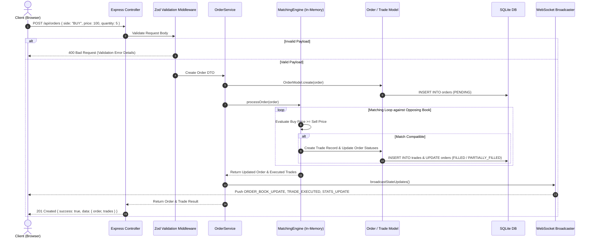
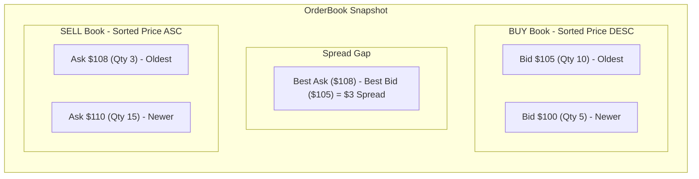

# BYTE Exchange — System Architecture & Component Flow Diagrams

This document contains visual diagrams illustrating the system architecture, component relationships, and execution flow of the **BYTE Order Matching System**.

---

## 1. High-Level System Architecture Diagram

```mermaid
graph TD
    subgraph Client Layer
        UI["React 18 Trading Terminal"]
        WS_Client["WebSocket Client (useWebSocket Hook)"]
        Axios["Axios REST API Client"]
    end

    subgraph Server Layer (Express + TypeScript)
        CORS["CORS & Request Middleware"]
        ZOD["Zod Request Validation"]
        Router["Express API Routers (/orders, /trades, /stats, /orderbook)"]
        Controllers["Controllers Layer"]
        Services["Services Layer (OrderService, TradeService, StatsService)"]
        Engine["In-Memory MatchingEngine (Price-Time Priority)"]
        WS_Server["WebSocket Server (ws Broadcaster)"]
    end

    subgraph Data & Persistence Layer
        Model["Repository Models (OrderModel, TradeModel)"]
        DB[(SQLite Database - WAL Mode)]
    end

    UI --> Axios
    UI --> WS_Client
    Axios -->|HTTP POST/GET/DELETE| CORS
    CORS --> ZOD
    ZOD --> Router
    Router --> Controllers
    Controllers --> Services
    Services --> Engine
    Engine -->|Persist Order / Trade| Model
    Model -->|Prepared SQL Statements| DB
    Engine -->|Trigger Broadcast| WS_Server
    WS_Server -->|WS Events: ORDER_BOOK_UPDATE, TRADE_EXECUTED| WS_Client
    WS_Client -->|Live React State Update| UI
```

---

## 2. Order Submission & Matching Engine Execution Sequence



---

## 3. Orderbook Data Structure Organization


